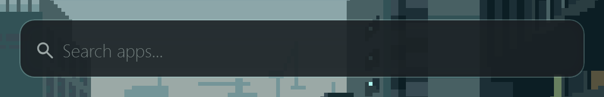
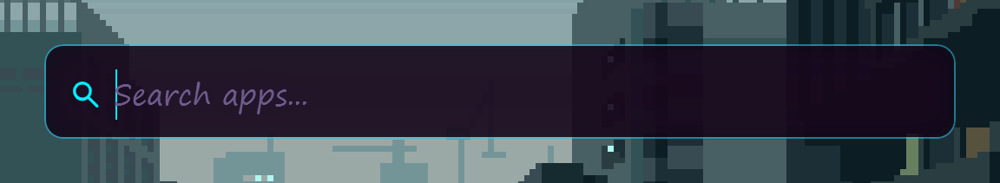
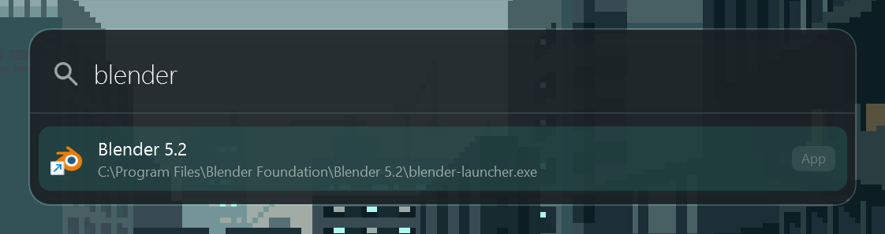
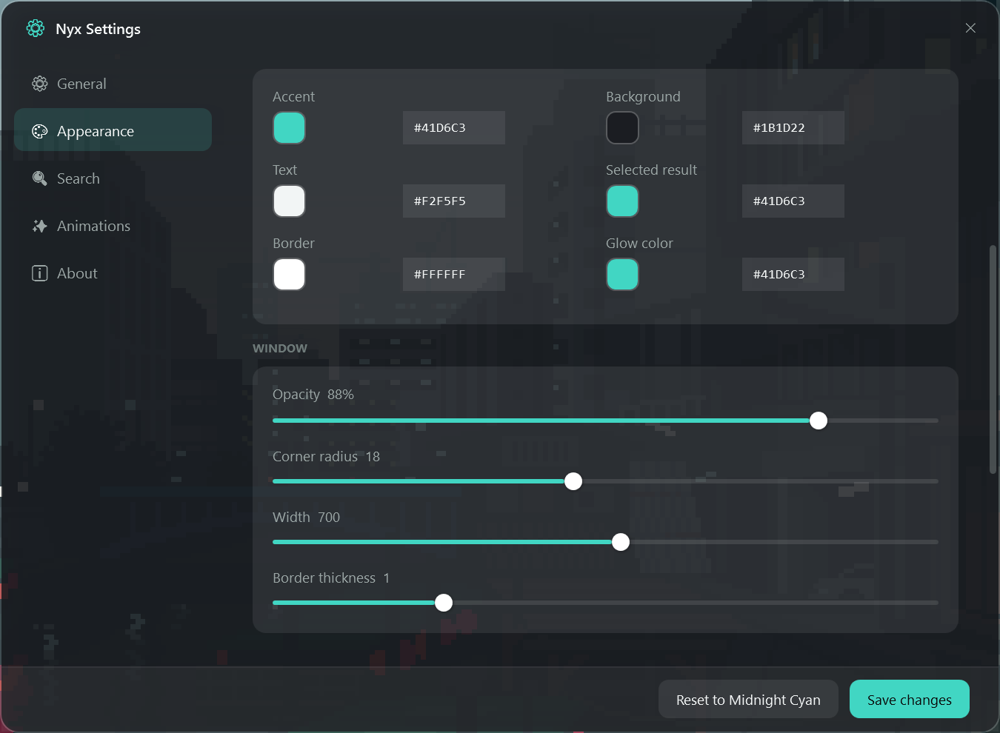
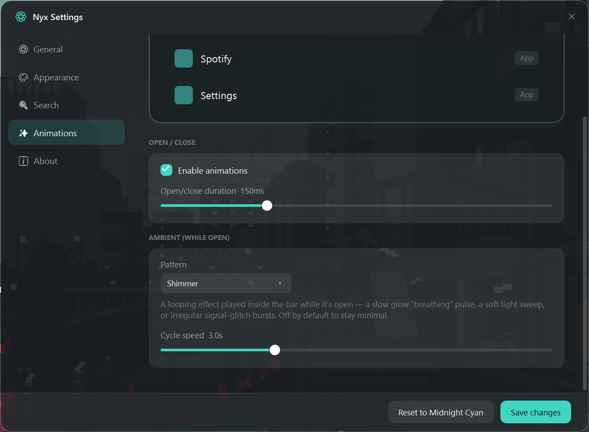

# Nyx

A fast, keyboard-first app launcher for Windows — press a hotkey, start typing, hit Enter. Inspired by Spotlight/Alfred/PowerToys Run, built from scratch in C#/.NET 8/WPF, with a full visual theming system underneath.

<p align="center">
  
  
</p>
<p align="center"><em>Same search bar, two themes — Midnight Cyan (default) and Cyberpunk.</em></p>

<p align="center">
  
</p>

## Features

- **Global hotkey** (`Ctrl+Space` by default, rebindable) — summon Nyx from anywhere, instantly.
- **Fuzzy search** over installed applications — Start Menu shortcuts, desktop `.lnk`/`.exe` files, and packaged (Store) apps.
- **Keyboard-only flow** — arrow keys to move, Enter to launch, Esc to dismiss.
- **Multi-monitor aware** — opens centered on whichever monitor currently has focus.
- **Smooth open/close animations.**
- **Full theming system** — six built-in themes (Midnight Cyan, Obsidian, Nord, Dracula, Light, Cyberpunk) plus a custom color picker, live-previewed in Settings before you commit.
- **Ambient animations** per theme (subtle Pulse, Shimmer, or glitchy signal-jitter) — cosmetic only, fully optional.
- **Rebindable shortcuts** for both the search hotkey and the Settings hotkey (`Ctrl+,` by default).
- **Runs quietly in the tray** — single background instance, no admin rights required.

<p align="center">
  
  
</p>

## Install

Grab the latest installer from [Releases](../../releases) and run `NyxSetup.exe`. It installs to your user profile (no admin prompt), adds a Start Menu shortcut, and optionally a desktop icon / launch-at-startup.

To uninstall, use "Uninstall Nyx" from the Start Menu — this also removes its settings under `%LocalAppData%\Nyx`.

## Usage

| Action | Shortcut |
|---|---|
| Open Nyx | `Ctrl + Space` |
| Open Settings | `Ctrl + ,` |
| Move selection | `↑` / `↓` |
| Launch selected result | `Enter` |
| Dismiss | `Esc` |

Both shortcuts can be rebound from Settings.

## Building from source

Requires [.NET 8 SDK](https://dotnet.microsoft.com/download/dotnet/8.0) and Windows.

```bash
dotnet build -c Release
```

To build the installer yourself, install [Inno Setup](https://jrsoftware.org/isinfo.php) and run:

```bash
ISCC.exe installer/Nyx.iss
```

This publishes a self-contained `win-x64` build and packages it into `installer/output/NyxSetup.exe`.

## Project structure

```
Views/         XAML windows (main search bar, Settings)
ViewModels/    MVVM view models
Services/      Hotkeys, app discovery, launching, settings, logging
Themes/        Theme engine — ThemeDefinition, ThemeService, built-in presets
Search/        Fuzzy search engine + providers
Models/        Plain data models
Assets/        App icon
installer/     Inno Setup script
```

## Privacy & safety

Nyx makes no network calls, collects no telemetry, and requests no elevated privileges. It only reads local Start Menu/Desktop shortcuts to build its search index and only launches what you select. See the codebase for details — nothing is hidden.

## Credits

Built with [Claude Code](https://claude.com/claude-code). App icon generated locally via [ComfyUI](https://github.com/comfyanonymous/ComfyUI) (SDXL).

## License

MIT
